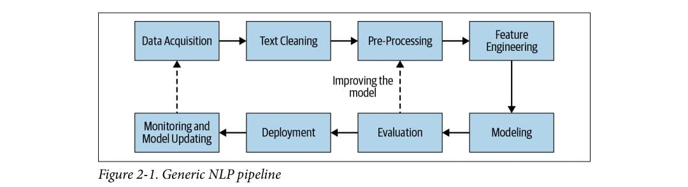

# Project10-Sentimental-Analysis-On-Movie-Reviews
## Overview
This project aims to perform sentiment analysis on IMDB dataset reviews using both traditional machine learning models and deep learning models.

## Workflow Diagram 

## Data Preprocessing
1. Remove Chatwords: Replace chatwords (e.g., "LOL", "BTW") with their corresponding meanings.
2. Remove HTML Tags: Clean the text from HTML tags.
3. Remove URLs: Remove URLs from the text.
4. Remove Punctuations: Remove punctuations from the text.
5. Convert to Lowercase: Convert all text to lowercase.
6. Tokenization:Tokenized all the text

## Feature Extraction
For traditional machine learning models, we use TF-IDF vectorization. For the LSTM model, we use tokenization and padding.

## Model Training and Evaluation
The models used for this task include:

1. Logistic Regression
2. Naive Bayes
3. Support Vector Machine (SVM)
4. Long Short-Term Memory (LSTM)

## Results
The performance of each model is evaluated using accuracy. The results are as follows:

### 1.Machine Learning
  Algorithm	  Accuracy	   Precision	   Recall	       F1
1.	SVC	      0.895735	   0.891865	    0.903252	  0.897522
2.	NB	      0.864173	   0.874387	    0.853980	  0.864063
3.  LR	      0.882021	   0.876691	    0.892081	  0.884319

### 2. LSTM
1. Train Accuracy: 0.9307
2. Test accuracy: 0.875567
3. F1 Score: 0.877676
4. Recall: 0.889312
5. Precision: 0.8663405

## Conclusion
This project demonstrates how to perform sentiment analysis on IMDB dataset reviews using various machine learning and deep learning models. The LSTM model, with its ability to capture sequential dependencies in text, shows promising results compared to traditional machine learning models.
